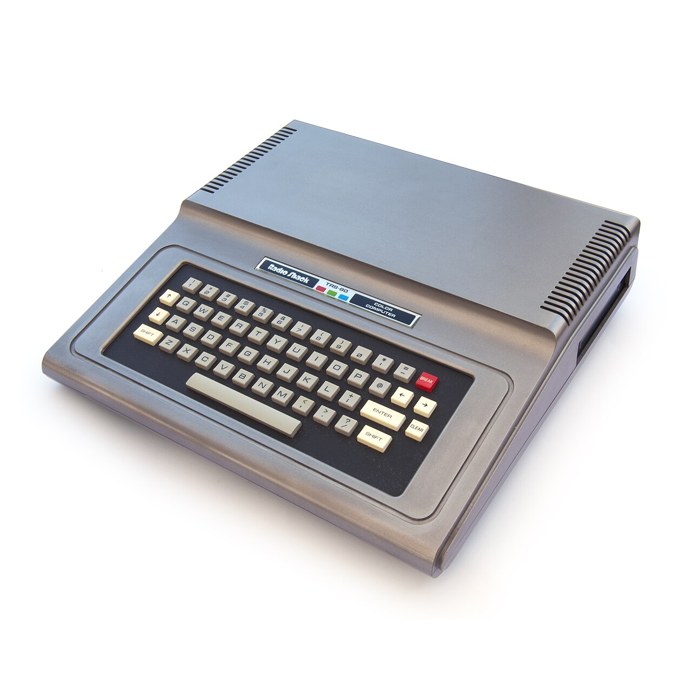
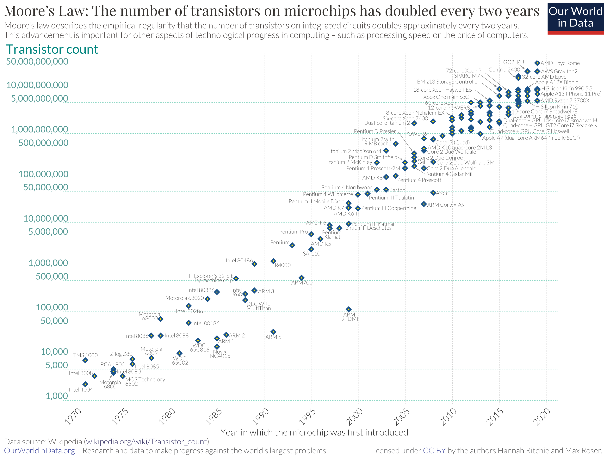
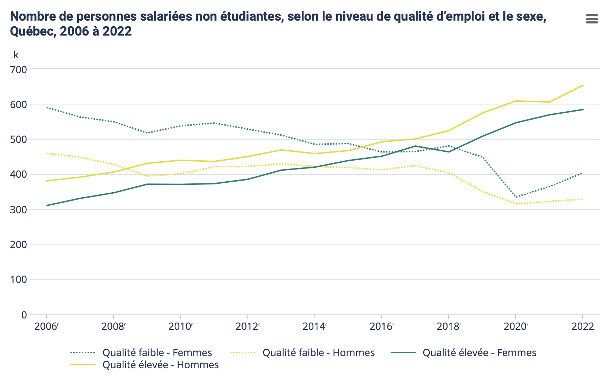
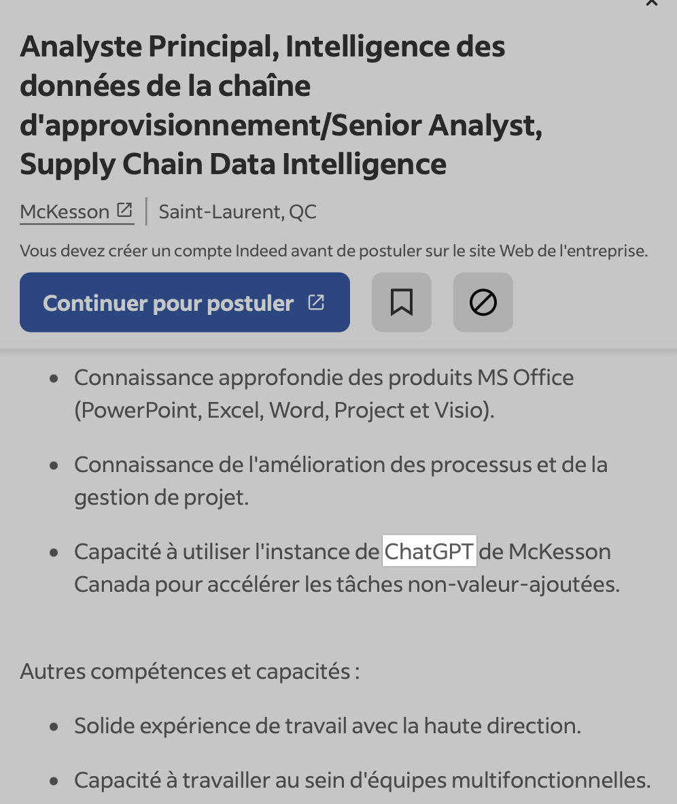
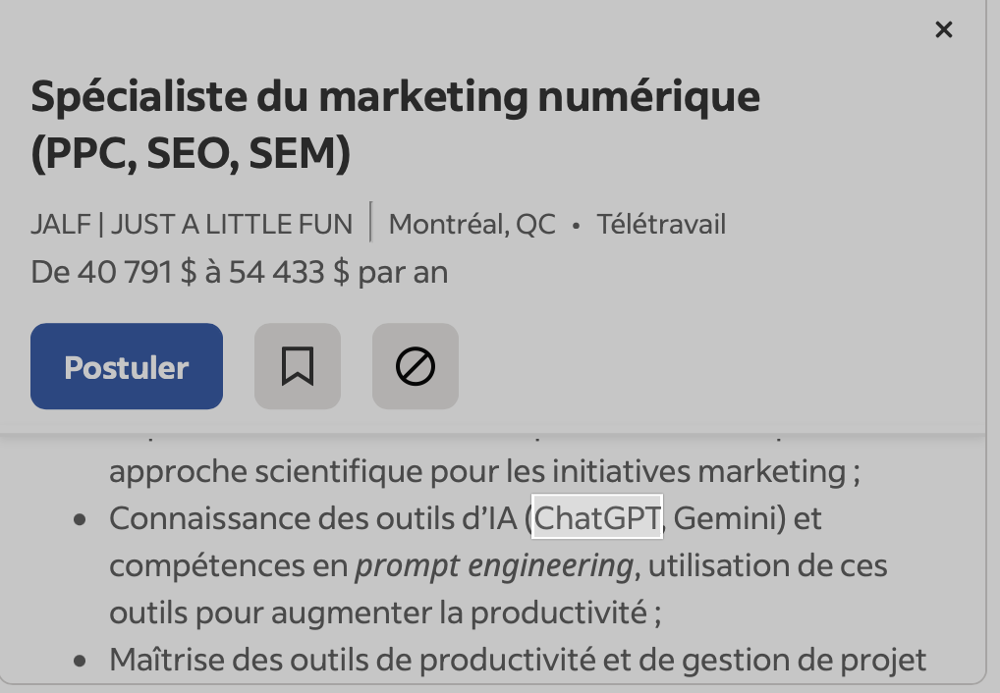
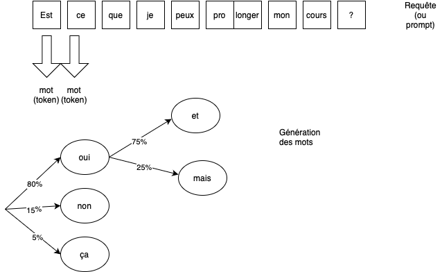
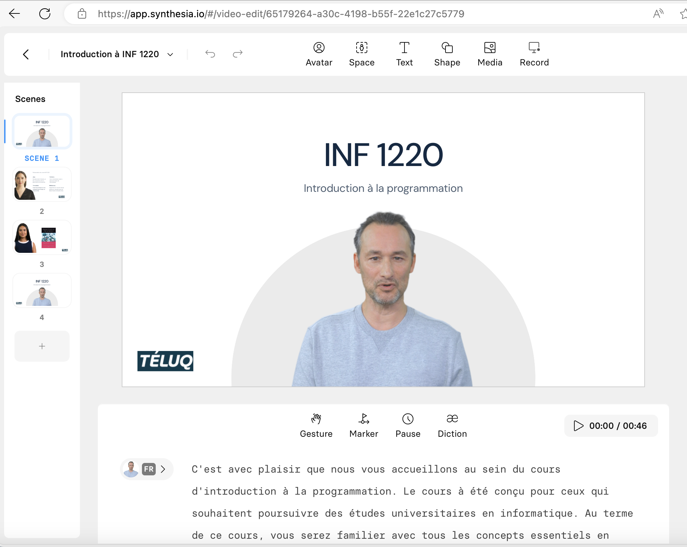
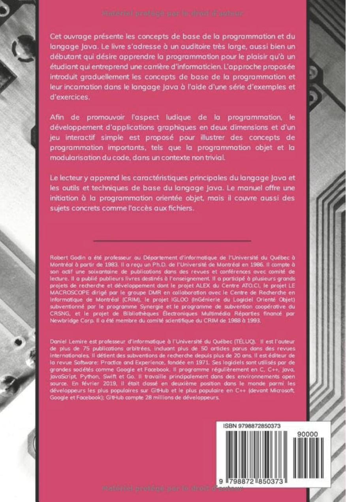
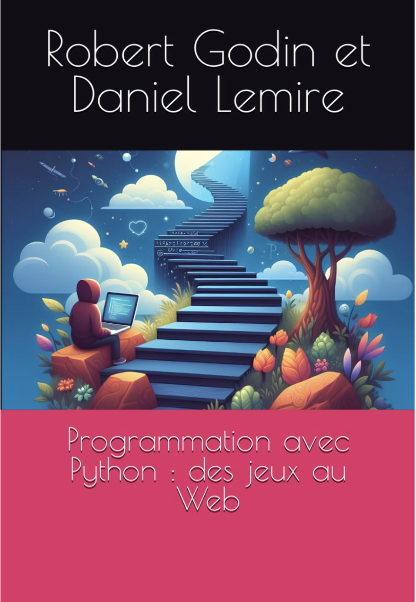
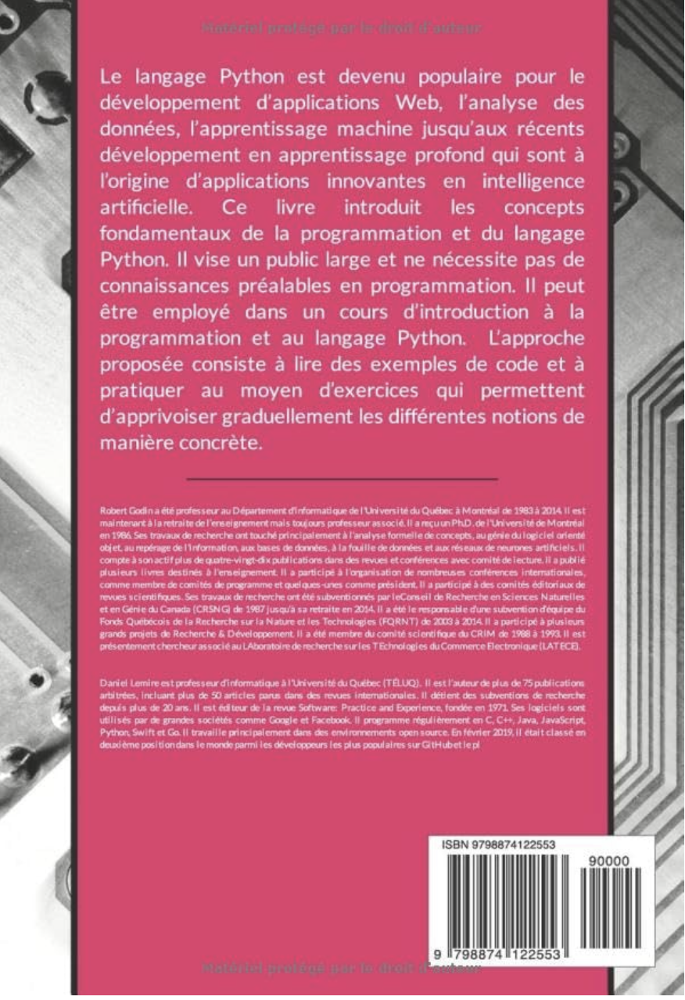

<!-- -->

<!--  --- -->

## <!--fit--> Intelligence artificielle

Daniel Lemire
professeur, Université du Québec (TÉLUQ)
Montréal :canada:

---

## Robot conversationnelle basé sur le guide des études

---

## 1950

*Je pense que dans une cinquantaine d'années, il sera possible de programmer les ordinateurs de manière à ce qu'un interrogateur moyen n'ait pas plus de 70 % de chances de reconnaître qu'il s'agit d'une machine.*

(Alan Turing)

---

## 1977

TRS-80 : 9000 transistors

	

16 milliard, 2 million fois plus.

---

---

$2^{21} \approx 2,000,000$

En 42 ans: $2,000,000 \times$.

---

## 1987-1989

INF 5100 L’intelligence artificielle – comprendre et prolonger l’intelligence humaine

3000 étudiants

---

## 1992

Laboratoire LICEF : applications de l’IA et les systèmes-experts à l’éducation et à la gestion

- Institut d’Intelligence artificielle appliquée
- Laboratoire sur la science des données
 

---

## 1994  

Le logiciel Chinook bat le meilleur joueur de dames au monde (par forfait).

---

## 1997 

Un puissant ordinateur conçu pour jouer aux échecs (Deep Blue) a battu le champion du monde (Kasparov).

---

## 1997 

IBM Watson, un puissant système informatique, bat les meilleurs humains au jeu Jeopardy. 

---

## 2006

 Rainbows End (Vernor Vinge): roman en 2025, singularité technologique en 2030

- numérisation de tous les livres
- drones
- économie des petits boulots
- fin de la vie privée, réseaux sociaux omniprésents
- réalité augmentée (Apple Vision)
- voitures autonomes
- fin des journaux

---

## 2009

Un programme informatique (Pocket Fritz) fonctionnant sur un téléphone portable atteint le niveau de Grand Maître aux échecs.

---

## 2011

 L'État du Nevada autorise les voitures autonomes à circuler dans ses rues. 

---

## 2016

- L'intelligence artificielle bat un joueur de Go professionnel. 

- Tesla équipe toutes ses voitures d'un système de conduite autonome.

---

## 2016

Un professeur d'informatique (Georgia Tech.) disposait d'un ensemble d'assistants de personnes tutrices en ligne, toutes humaines à l'exception d'un robot. Un  étudiant de la classe a découvert que l'un des assistants n'était pas un être humain, parce qu'il avait tendance à répondre aux questions beaucoup plus rapidement que les autres. 

https://www.washingtonpost.com/news/innovations/wp/2016/05/11/this-professor-stunned-his-students-when-he-revealed-the-secret-identity-of-his-teaching-assistant/

---

## 2017 

- DeepStack devient le premier programme informatique à battre des joueurs de poker professionnels au poker sans limite.

- Une équipe de Google (Alphabet/DeepMind) a créé un système informatique (AlphaZero) capable d'apprendre des jeux comme le Go et les échecs en quelques heures, en se basant uniquement sur les règles, puis de battre les meilleurs systèmes logiciels et tous les êtres humains.

---

## 2018

- BERT
- GPT-1

---

## 2022 

ChatGPT est largement considéré comme une percée de l'IA : il peut produire des dissertations complètes dans diverses langues.

GPT-3.5

---

## 2022 

*Nous avons constaté qu'un étudiant utilisant l'intelligence artificielle peut réaliser des travaux de programmation sans éveiller les soupçons de MOSS, un outil de détection de plagiat et de similarité logicielle largement utilisé. Cela est vrai malgré le fait que l'intelligence n'a pas été formé aux problèmes en question et qu'il n'a pas reçu d'exemples pour travailler.*

https://dl.acm.org/doi/abs/10.1145/3511808.3557079

---

## 2023

*GPT-4 a atteint le 90e centile à l'examen du barreau en Californie.*

https://www.cnbc.com/2023/03/14/openai-announces-gpt-4-says-beats-90percent-of-humans-on-sat.html

---

## 2023

Un système qui génère des questions d'exercice:

* la matière générée par le système est adaptée aux étudiants et dépassent même la qualité du matériel écrits par des humains.*

Xiao et al., 2023
https://aclanthology.org/2023.bea-1.52/

---

## 2023-2024

- GPQA: biologie, physique et chimie. 
- Performance d'un humain moyen ayant accès à l'Internet 34%
- GPT-4 36%, "Claude 3 Opus" atteint 50%.

---

*Le GPT-4 fait preuve d'une compétence exceptionnelle dans la résolution de problèmes financiers, atteignant un taux de précision de 85%. Il donne rarement des réponses complètement incorrectes ou non pertinentes.*

https://www.tandfonline.com/doi/full/10.1080/08832323.2023.2253963

---

2024

*Étant donné les compétences considérables des intelligences artificielles, les examens non surveillés sont très vulnérables.*

https://iopscience.iop.org/article/10.1088/1361-6552/ad1fa2/meta

---

## 2024 Robotaxi

---

## 2024 - gouvernement du Québec

Cette technologie, qui permet d’imiter l’intelligence humaine à travers différents outils informatiques, sera notamment mise à l’essai sur le site de données ouvertes du gouvernement du Québec, avec l'ajout d'un robot conversationnel.

https://www.journaldequebec.com/2024/02/29/lintelligence-artificielle-aidera-a-reduire-la-taille-de-letat-affirme-eric-caire

---

## Effet sur l'emploi

---

*Aucune donnée historique ou contemporaine convaincante ne suggère que les progrès technologiques nous conduisent vers un avenir sans emploi. Au contraire, nous prévoyons qu'au cours des deux prochaines décennies, les pays industrialisés auront plus d'offres d'emploi que de travailleurs pour les occuper, et que la robotique et l'automatisation joueront un rôle de plus en plus crucial pour combler ces lacunes.* (Autor, 2022)

---

*l'utilisation accrue de l'informatique est associée à une croissance des emplois bien rémunérés (...)*

How Computer Automation Affects Occupations: Technology, Jobs, and Skills, James Bessen, 2016

---

 

---

 

---

---

*L'impact de l'IA sur le marché du travail est directement lié à l'inadéquation des compétences.*

Zarifhonarvar, Ali (2023) : Economics of ChatGPT: A Labor Market View on the Occupational Impact of Artificial Intelligence, ZBW - Leibniz Information Centre for Economics, Kiel, Hamburg

---

## 2024 - emplois

---

## 2024 - emplois

---

## 2024 - emplois

---

## 2024 - emplois

---

## La technologie

---

Un moteur de recherche n'est qu'un chatbot très bête.
(Pedro Domingos)

---

## Intelligence artificielle générative

- Synthèse d'images, de vidéos et de textes
- Génération de PowerPoint, de rapports
- deep fake
- Robot conversationnels (texte, audio)
- Génération d'idées
- Traduction (code informatique, langue naturelle)
- Résumés (images, vidéos)

---

- token (mot)
- température
- fenêtre de contexte

---

---

---

## Dizaines de milliers de modèles open source

---

## Apprentissage/inférence

- L'apprentissage est distinct de l'application du modèle.

- Le  modèle est fixe. GPT-3 est GPT-3. Il ne s'améliore pas quand on l'utilise.

---

## Hallucination

Intégration des connaissances : ça nous prend du contenu... un manuel, des notes de cours, etc.

*Retrieval-augmented generation (RAG)*

---

## Programmation?

On peut donner des instructions:

- Répond avec empathie.
- Répond comme un employé de la TÉLUQ.

---

## Programmation?

- On peut filter les questions... (par ex., exiger que la question soit en français)
- Et améliorer les réponses (liens, tableaux, etc.).

---

https://www.youtube.com/watch?v=sCuxwhZWX0s

---

---

---

---

---

---

---

## Conclusion

- La TÉLUQ est dans l'IA depuis le début.
- Les employeurs (incluant les gouvernements) veulent des employés formés avec de l'IA.
- Les quiz, examens, travaux conventionnels sont probablement déjà obsolètes (80%).
- On peut faire des exercices, des textes, des exemples, des vidéos à une fraction du coût en améliorant la qualité.
- Pas de mises à pied, au contraire.
- Il faut former une génération de professionnels à l'IA.
