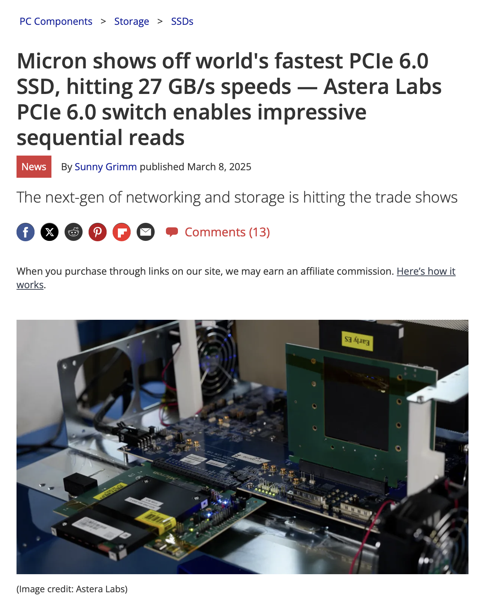
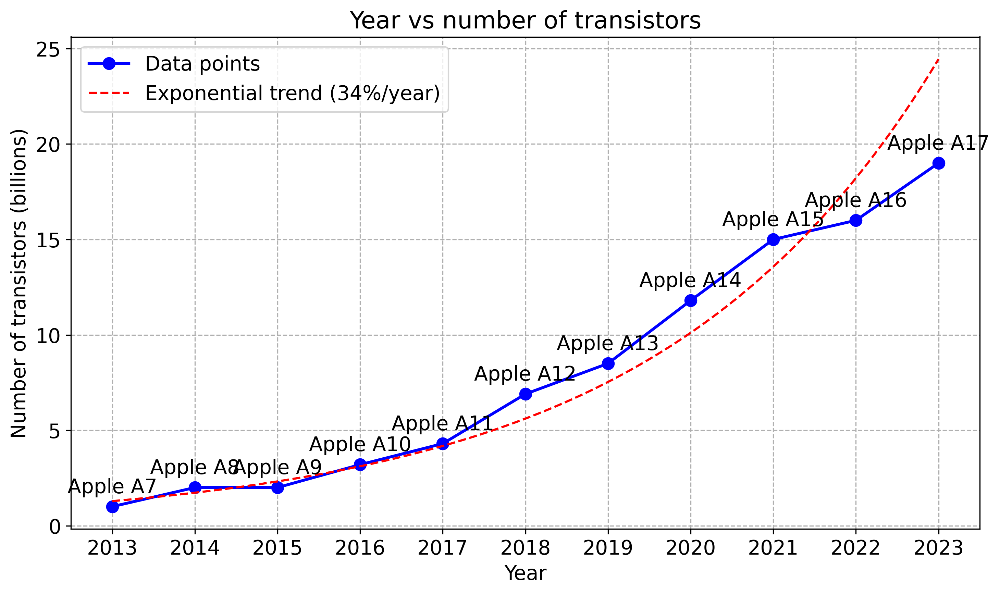
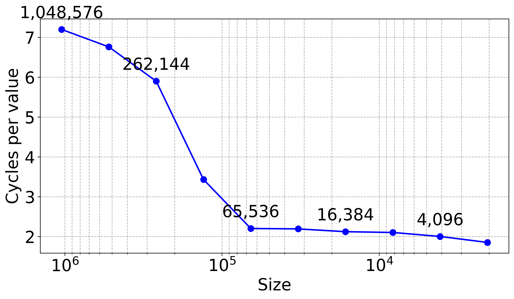
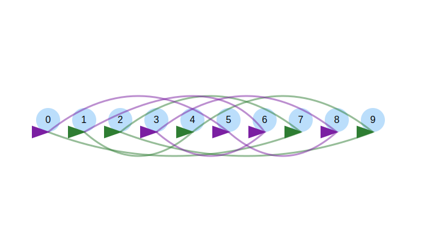
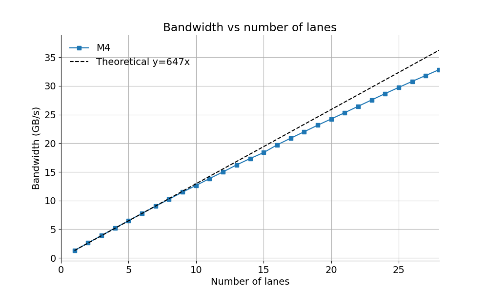
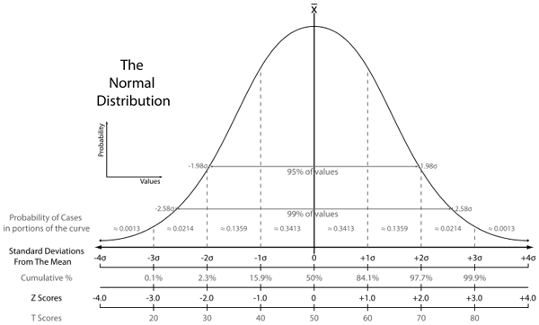
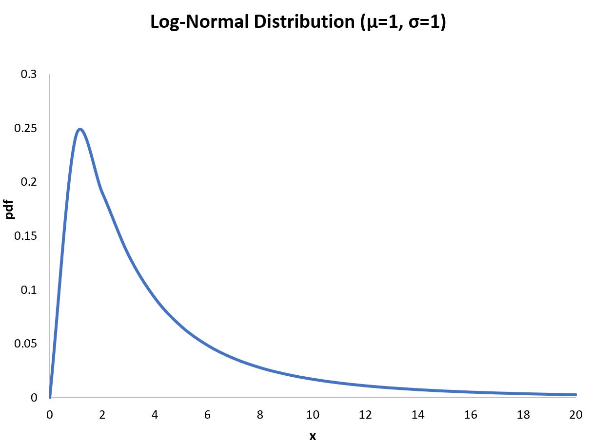

<!-- -->

<!--  --- -->

## <!--fit--> Algorithms for Modern Processor Architectures


Daniel Lemire, professor
Université du Québec (TÉLUQ)
Montréal :canada:

blog: https://lemire.me 
X: [@lemire](https://x.com/lemire)
GitHub: [https://github.com/lemire/](https://github.com/lemire/)

All software for this talk: https://github.com/lemire/talks/tree/master/2025/sea/software

---


# Disk at gigabytes per second




---


# Input/Output

- PCI Express 4.0 (2011) : 31.5 GB/s (16 lanes)
- PCI Express 5.0 (2017) : 63 GB/s (16 lanes)
- PCI Express 6.0 (2019) : 128 GB/s (16 lanes)
- PCI Express 7.0 (2022) : 242 GB/s (16 lanes)


---

# High Bandwidth Memory

- Xeon Max processors contain 64 GB of HBM
- Bandwidth 800 GB/s


---


# Some numbers

- Time is discrete: clock cycle
- Processors: 4 GHz ($4 \times 10^9$ cycles per second)
- One cycle is 0.25 nanoseconds
- light: 7.5 centimeters
- One byte per cycle: 4 GB/s

**Easily CPU bound**

---

# Frequencies and transistors

| processor | year  | frequency  | transistors    |
|-----------|-------|------------|----------------|
| Pentium 4 | 2000  | 3.8 GHz    | 0.040 billions | 
| Intel Haswell  | 2013  | 4.4 GHz    | 1.4 billions  | 
| Apple M1  | 2020  | 3.2 GHz    | 16 billions    | 
| Apple M2  | 2022  | 3.49 GHz   | 20 billions    |
| Apple M3  | 2024  | 4.05 GHz   | 25 billions    | 
| Apple M4  | 2024  | 4.5 GHz    | 28 billions    |
| AMD Zen 5 | 2024  | 5.7 GHz    | 50 billions    |


---




---

# Where do the transistors go?

- More cores
- More superscalar execution
- Better speculative execution
- More cache, more memory-level parallelism
- Better data-level parallelism (SIMD)


---

# Where do the transistors go?

- More cores
- More superscalar execution (more instructions per cycle)
- Better speculative execution ($\to$ more instructions per cycle)
- More cache, more memory-level parallelism  ($\to$ more instructions per cycle)
- Better data-level parallelism (SIMD)  ($\to$ fewer instructions)


---

# Superscalar execution

| processor       | year    | arithmetic logic units    | SIMD units |
|-----------------|---------|---------------------------|-----|
| Pentium 4       |  2000   |    2                      | $2 \times 128$ | 
| AMD Zen 2       |  2019   |    4                      | $2 \times 256$ |
| Apple M*       |  2019   |    6+                      | $4 \times 128$ |
| Intel Lion Cove       |  2024   |    6                | $4 \times 256$ |
| AMD Zen 5       |  2024   |    6                      | $4 \times 512$ |

Moving to up to 4 load/store per cycle

---

# Parsing a number

- `1.3321321e-12` to `double`

```cpp
double result;
fast_float::from_chars(
  input.data(), input.data() + input.size(), result);
```

*Reference*: Number Parsing at a Gigabyte per Second, Software: Practice and Experience 51 (8), 2021

---

# Parsing a number


| processor       | instructions       | instructions/cycle | cycles |
|-----------------|--------------------|--------------------|--------|
| Apple M4        | 211                | 7.5                | 25     |
| Intel Ice Lake  | 191                |  5                 | 39     |


---

# Lemire's Rule 1

> Modern processors execute *nearly* as many instructions per cycle as you can supply.

-  with caveats: branching, memory, and input/output

---

# Lemire's Corrolary 1

> In computational workloads (batches), minimizing instruction count is critical for achieving optimal performance.


---

# Lemire's Tips

1. Batch your work in larger units to save instructions.
2. Simplify the processing down to as few instructions as possible.


---

# Going back to number parsing


- Our number parser is everywhere: major browsers (Safari, Chrome), GCC (12+), C#, Rust
- About $4 \times$ faster than the conventional alternatives.
- How did we do it?


---

We massively reduced the number of CPU instructions required.

| function | instructions |
|----------|--------------|
| strtod   |     $> 1000$     |
| our parser   |    $\approx 200$     |

*Reference*: 
Number Parsing at a Gigabyte per Second, Software: Practice and Experience 51 (8), 2021


---

## SWAR

- Stands for SIMD within a register
- Use normal instructions, portable (in C, C++,...)
- A 64-bit registers can be viewed as 8 bytes
- Requires some cleverness

---

## Check whether we have a digit

In ASCII/UTF-8, the digits 0, 1, ..., 9 have values
0x30, 0x31, ..., 0x39.

To recognize a digit:

- The high nibble should be 3.
- The high nibble should remain 3 if we add 6 (0x39 + 0x6 is 0x3f)


---


## Check whether we have 8 consecutive digits

(You are not supposed to understand this:)

```cpp
bool is_made_of_eight_digits_fast(const char *chars) {
  uint64_t val;
  memcpy(&val, chars, 8);
  return (((val & 0xF0F0F0F0F0F0F0F0) |
           (((val + 0x0606060606060606) & 0xF0F0F0F0F0F0F0F0) >> 4)) 
           == 0x3333333333333333);
}
```

(Works with ASCII, harder if input is UTF-16 as in Java/C#)

---

# Batching (unrolling)

6 to 7 instructions per multiplication

```cpp
  uint64_t sum = 0;
  for (size_t i = 0; i < length; i++)
    sum += (uint64_t)x[i] * y[i];
```

3 to 5 instructions per mutiplication

```cpp
    uint64_t sum = 0;
    for (; i < length - 3; i += 4)
      sum += (uint64_t)x[i] * y[i] 
             + (uint64_t)x[i + 1] * y[i + 1] 
             + (uint64_t)x[i + 2] * y[i + 2] 
             + (uint64_t)x[i + 3] * y[i + 3];
```


---


# Results

| processor       | instructions       | instructions/cycle | cycles |
|-----------------|--------------------|--------------------|--------|
| Apple M4        | 6                  | 5.2                | 1.2    |
|                 | 3.5                | 3.4                | 1.0    |
| Intel Ice Lake  | 7                  |  4.4               | 1.6    |
|                   | 5                  |  4.5               | 1.1    |

With unrolling, you can get close to 1 product+store per cycle

---

# Knuth's random shuffle

```cpp
for (size_t j = array.size() - 1; j > 0; --j) {
    size_t k = random_bounded(j + 1);
    std::swap(array[j], array[k]);
}
```


---

# Batched random shuffle


- Draw one random number
- Compute two indices (with high proba)
- Reduces the instruction count
- Reduces the number of branches


*Reference*: Batched Ranged Random Integer Generation, Software: Practice and Experience 55 (1), 2025

----

# Results (Apple M4)


Use a large array of 64-bit keys (8 MB).


| technique       | instructions       | instructions/cycle | cycles |
|-----------------|--------------------|--------------------|--------|
| Standard       | 20                | 3.8                | 5.2    |
| Batched (2)          | 15              |  4.8                | 3.1     |


---

# Branching

Hard-to-predict branches can derail performance


---

# Unicode (UTF-16)

- Code points from U+0000 to U+FFFF, a single 16-bit value.
- Beyond: a surrogate pair `[U+D800 to U+DBFF]` followed `U+DC00 to U+DFFF`


---

# Validate 


- Check whether we have a lone code unit ($x \leq \mathrm{0xD7FF} \lor x\geq \mathrm{0xDBFF}$), if so ok
- Check whether we have the first part of the surrogate ($\mathrm{0xD800} \leq x\leq \mathrm{0xDBFF}$) and if so check that we have the second part of a surrogate

---

# Validate 

```C++
    size_t i = 0;
    for (i < code_units.size()) {
        uint16_t unit = code_units[i];
        if (unit <= 0xD7FF || unit >= 0xE000) { ++i; continue; }
        if (unit >= 0xD800 && unit <= 0xDBFF) {
            if (i + 1 >= code_units.size()) { return false; }
            uint16_t next_unit = code_units[i + 1];
            if (next_unit < 0xDC00 || next_unit > 0xDFFF) { return false; }
            i += 2; // Valid surrogate pair
            continue;
        }
        return false;
    }
```

---

# Performance results (Apple M4)

| input type | cycles | instructions | instructions/cycle |
|------------|--------|--------------|--------------------|
| ASCII      |   1    |     7        |       7            |
| Alternate  |   1    |     8        |       8           |


1 character per second might be just 4 GB/s (slower than disk)

---

# Performance results (Apple M4)

| input type | cycles | instructions | instructions/cycle |
|------------|--------|--------------|--------------------|
| ASCII      |   1    |     7        |       7            |
| Alternate  |   1    |     8        |       8           |
| Random   |   7    |     8        |       1.1          |

We are now barely at 1 GB/s!

---

# Speculative execution

- Processors *predict* branches
- They execute code *speculatively* (can be wrong!)


---

# How much can your processor learn?

---

# How much can your processor learn?

| size | ns/value | GHz | cycles/value | instr/value | i/c |
|------|---------:|-----:|-------------:|------------:|-----:|
| 1048576 |      1.59 |    4.51 |          7.20 |         8.01 |  1.11 |
| 524288 |      1.50 |    4.51 |          6.76 |         8.01 |  1.19 |
| 262144 |      1.31 |    4.51 |          5.90 |         8.01 |  1.36 |
| 131072 |      0.76 |    4.52 |          3.43 |         8.01 |  2.34 |
|  65536 |      0.49 |    4.52 |          2.20 |         8.01 |  3.64 |
|  32768 |      0.49 |    4.52 |          2.19 |         8.02 |  3.66 |


---



----

# Finite state machine to the rescue

- Can identify characters by the most significant 8 bits.
- Trivial finite state machine: default, has just encountered a high surrogate, or error.

---

```cpp
static uint8_t transition_table[3][256] = {
    {...},
    {...},
    {...}
};

bool is_valid_utf16_ff(std::span<uint16_t> code_units) {
    uint8_t state = 0; // Start in Initial state
    for (auto code_unit : code_units) {
        uint8_t high_byte = code_unit >> 8;
        state = transition_table[state][high_byte];
    }
    return state == 0; // Valid only if we end in Initial state
}
```

---

# Performance results (Apple M4)

| input type | cycles | instructions | instructions/cycle |
|------------|--------|--------------|--------------------|
| branchy   |   7    |     8        |       1.1          |
| finite-state   |   1.1    |     7        |       6.4          |

The finite-state approach can be $7 \times$ faster!


----


# Rules of thumb

1. Processors can 'learn' thousands of branches: benchmark over massive inputs.
2. Pick a solution without branches when it provides the same performance.


---

A modern processor like the Apple M4 can learn to predict
nearly perfectly 10,000 random (0/1) branches.

| entries | % branch misses |
|---------|----------------:|
| 4096 | 0.2 |
| 8192 | 0.4 |
| 16384 | 4.4 |
| 32768 | 33.5 |
| 65536 | 41.7 |
| 524288 | 48.2 |

---

# Pipelining

How does the processor manage to validate one UTF-16 character per cycle
when it takes **many cycles** just to *load* the character?


---

# Cycle 1

```
🚂
```


---

# Cycle 2

```
🚂
 🚂
```


---

# Cycle 3

```
🚂
 🚂
   🚂
```

---

# Cycle 4

```
🚂   + 
 🚂
   🚂
    🚂
```

---

# Cycle 5

```
🚂   +
 🚂   +
   🚂
    🚂
     🚂
```

---

# Cycle 6


```
🚂   +
 🚂   +
  🚂   +
   🚂
    🚂
     🚂
```

---

# Cycle 7

```
🚂   +
 🚂   +
  🚂   +
   🚂   +
    🚂
     🚂
      🚂
```

--- 

# Little's Law

- Latency harms throughput
- Parallelism hides latency

$\mathrm{throughput} = \frac{\mathrm{parallelism}}{\mathrm{latency}}$


---

# Memory-level parallism

- Create large array of indices forming a cycle
- Start with [0,1,2,3,4]
- Shuffle so that no index can remain in place.
- Start with [4,0,3,2,1]
- Sandra Sattolo's algorithm
- This forms a random path


---

# 1 lane


---

# 2 lanes




---




---

# Consequence

An algorithm that hits 2 or 3 memory areas instead of just 1 is not necessarily 
2 or 3 times slower! Might be just as fast!


---


# Bloom filter

8 hash functions

|  | not in set | in set          |
|:-----------------|:---------------|:--------------|
|    cache misses           | 3.5             | 7.5            |

(Intel Ice Lake processor, out-of-cache filter)

**Less than half the cache misses**


---


# Bloom filter

8 hash functions

|  | not in set | in set          |
|:-----------------|:---------------|:--------------|
|    cache misses           | 3.5             | 7.5            |
| cycles              | 135            | 170         |

(Intel Ice Lake processor, out-of-cache filter)

**Only a 25% difference in speed**

---

# Data-level parallelism 

---


---


## SIMD

- Stands for Single instruction, multiple data
- Allows us to process 16 (or more) bytes or more with one instruction
- Supported on all modern CPUs (phone, laptop)


---

# Deltas (C)

successive difference:

```cpp
    for (size_t i = 1; i < n; ++i) {
        dst[i] = src[i] - src[i - 1];
    }
```


prefix sum:

```cpp
    for (size_t i = 1; i < n; ++i) {
        dst[i] = dst[i - 1] + src[i];
    }
```

---

# Apple M4

| algorithm             | cycles   | instructions   | ins/cycle  |
|-----------------------|----------|----------------|------------|
| successive difference | 1   | 6  | 6  |
| prefix sum | 1  | 5  | 5  |

---

# Now allow SIMD!


| algorithm             | cycles   | instructions   | ins/cycle  |
|-----------------------|----------|----------------|------------|
| successive difference | 0.25   | 0.9 | 3.8  |
| prefix sum | 1   | 5  | 5 |

Autovectorization worked for differences, but failed for the prefix sum

---

# Need to learn SIMD design magic !


---

# UTF-16, random (adversarial), Apple M4


| input type | cycles | instructions | instructions/cycle |
|------------|--------|--------------|--------------------|
| branchy   |   7    |     8        |       1.1          |
| finite-state   |   1.1    |     7        |       6.4          |
| SIMD   |   0.3   |     0.4      |       4.6         |

- SIMD *correction* function (which copies the data) faster than the non-SIMD validation

---

# Interested, check these projects

- simdjson: fastest JSON parser in the world https://simdjson.org

ClickHouse, Microsoft, Shopify, Intel, Meta Velox, Google Pax, the Node.js runtime,


- simdutf: Unicode routines (UTF8, UTF16, UTF32) and Base64 https://github.com/simdutf/simdutf

Node.js, WebKit/Safari, Ladybird, Chromium, Cloudflare Workers and Bun


---

# Measurements

- We often assume that measurments (timings) are normally distributed.
- It is often an incorrect assumption.

---

# Sigma events

 

---


- 1-sigma is 32%
- 2-sigma is 5%
- 3-sigma is 0.3% (once ever 300 trials)
- 4-sigma is 0.00669% (once every 15000 trials)
- 5-sigma is 5.9e-05% (once every 1,700,000 trials)
- 6-sigma is 2e-07% (once every 500,000,000)

$e^{- n^2 / 2} /(n * \sqrt{\pi /2}) \times  100$ for $n> 3$


---

# What if we dealt with log-normal distributions?

 

https://lemire.me/blog/2023/04/06/are-your-memory-bound-benchmarking-timings-normally-distributed/


---

# Consequences

- If your measurements are normally distributed, the 'error' falls off as $1/\sqrt{N}$
- Reality: often does not work at all.

<!--https://lemire.me/blog/2023/04/27/hotspot-performance-engineering-fails/-->


---

# Consequences

- If your measurements are normally distributed, the 'error' falls off as $1/\sqrt{N}$
- Reality: often does not work at all.
- If your measurements are normally distributed, the absolute minimum is meaningless.
- Reality: the absolute minimum is a often a reliable metric.

<!--https://lemire.me/blog/2023/04/27/hotspot-performance-engineering-fails/-->

---

# Conclusion

- Processors are get much better! Wider!
- 'hot spot' engineering can fail, better to reduce overall instruction count.
- Branchy code can do well in synthetic benchmarks, but be careful.