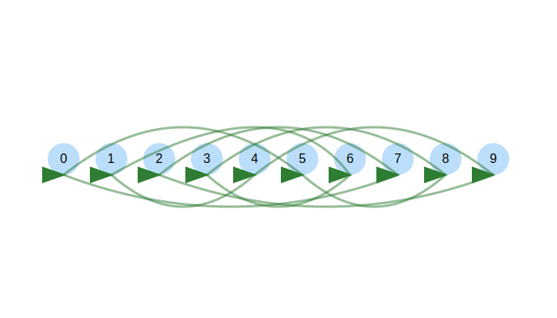

<!-- -->

<!--  --- -->

## <!--fit--> Algorithms for Modern Processor Architectures


Daniel Lemire, professor
Université du Québec (TÉLUQ)
Montréal :canada:

blog: https://lemire.me 
X: [@lemire](https://x.com/lemire)
GitHub: [https://github.com/lemire/](https://github.com/lemire/)

All software for this talk: https://github.com/lemire/talks/tree/master/2025/sea/software

---


# Disk at gigabytes per second


---


# Input/Output

- PCI Express 4.0 (2011) : 31.5 GB/s (16 lanes)
- PCI Express 5.0 (2017) : 63 GB/s (16 lanes)
- PCI Express 6.0 (2019) : 128 GB/s (16 lanes)
- PCI Express 7.0 (2022) : 242 GB/s (16 lanes)


---

# High Bandwidth Memory

- Xeon Max processors contain 64 GB of HBM
- Bandwidth 800 GB/s


---


# Some numbers

- Time is discrete: clock cycle
- Processors: 4 GHz ($4 \times 10^9$ cycles per second)
- One cycle is 0.25 nanoseconds
- light: 7.5 centimeters
- One byte per cycle: 4 GB/s

**Easily CPU bound**

---

# Frequencies and transistors

| processor | year  | frequency  | transistors    |
|-----------|-------|------------|----------------|
| Pentium 4 | 2000  | 3.8 GHz    | 0.040 billions | 
| Intel Haswell  | 2013  | 4.4 GHz    | 1.4 billions  | 
| Apple M1  | 2020  | 3.2 GHz    | 16 billions    | 
| Apple M2  | 2022  | 3.49 GHz   | 20 billions    |
| Apple M3  | 2024  | 4.05 GHz   | 25 billions    | 
| Apple M4  | 2024  | 4.5 GHz    | 28 billions    |
| AMD Zen 5 | 2024  | 5.7 GHz    | 50 billions    |


---


---

# Where do the transistors go?

- More cores
- More superscalar execution
- Better speculative execution
- More cache, more memory-level parallelism
- Better data-level parallelism (SIMD)


---

# Superscalar execution

| processor       | year    | arithmetic logic units    |
|-----------------|---------|---------------------------|
| Pentium 4       |  2000   |    2                      |
| AMD Zen 2       |  2019   |    4                      |
| Apple M*       |  2019   |    6+                      |
| AMD Zen 5       |  2024   |    6                      |
| Intel Lion Cove       |  2024   |    6                |

Moving to up to 4 load/store per cycle

---

# Parsing a number

- `1.3321321e-12` to `double`

```cpp
double result;
fast_float::from_chars(
  input.data(), input.data() + input.size(), result);
```

*Reference*: Number Parsing at a Gigabyte per Second, Software: Practice and Experience 51 (8), 2021

---

# Parsing a number


| processor       | instructions       | instructions/cycle | cycles |
|-----------------|--------------------|--------------------|--------|
| Apple M4        | 211                | 7.5                | 25     |
| Intel Ice Lake  | 191                |  5                 | 39     |


---

# Lemire's Rule 1

> Modern processors execute *nearly* as many instructions per cycle as you can supply.

-  with caveats: branching, memory, and input/output

---

# Lemire's Corrolary 1

> In computational workloads (batches), minimizing instruction count is critical for achieving optimal performance.


---

# Lemire's Tips

1. Batch your work in larger units to save instructions.
2. Simplify the processing down to as few instructions as possible.

---

# Batching (unrolling)

6 to 7 instructions per multiplication

```cpp
  uint64_t sum = 0;
  for (size_t i = 0; i < length; i++)
    sum += (uint64_t)x[i] * y[i];
```

3 to 5 instructions per mutiplication

```cpp
    uint64_t sum = 0;
    for (; i < length - 3; i += 4)
      sum += (uint64_t)x[i] * y[i] 
             + (uint64_t)x[i + 1] * y[i + 1] 
             + (uint64_t)x[i + 2] * y[i + 2] 
             + (uint64_t)x[i + 3] * y[i + 3];
```


---


# Results

| processor       | instructions       | instructions/cycle | cycles |
|-----------------|--------------------|--------------------|--------|
| Apple M4        | 6                  | 5.2                | 1.2    |
|                 | 3.5                | 3.4                | 1.0    |
| Intel Ice Lake  | 7                  |  4.4               | 1.6    |
| Intel Ice Lake  | 5                  |  4.5               | 1.1    |

With unrolling, you can get close to 1 product+store per cycle

---

# Knuth's random shuffle

```cpp
for (size_t j = array.size() - 1; j > 0; --j) {
    size_t k = random_bounded(j + 1);
    std::swap(array[j], array[k]);
}
```


---

# Batched random shuffle


- Draw one random number
- Compute two indices (with high proba)
- Reduces the instruction count
- Reduces the number of branches


*Reference*: Batched Ranged Random Integer Generation, Software: Practice and Experience 55 (1), 2025

----

# Results (Apple M4)


Use a large array of 64-bit keys (8 MB).


| technique       | instructions       | instructions/cycle | cycles |
|-----------------|--------------------|--------------------|--------|
| Standard       | 20                | 3.8                | 5.2    |
| Batched (2)          | 15              |  4.8                | 3.1     |


---

# Branching

Hard-to-predict branches can derail performance


---

# Unicode (UTF-16)

- Code points from U+0000 to U+FFFF, a single 16-bit value.
- Beyond: a surrogate pair `[U+D800 to U+DBFF]` followed `U+DC00 to U+DFFF`


---

# Validate 


- Check whether we have a lone code unit ($x \leq \mathrm{0xD7FF} \lor unit\geq \mathrm{0xDBFF}$), if so ok
- Check whether we have the first part of the surrogate ($\mathrm{0xD800} \leq x\leq \mathrm{0xDBFF}$) and if so check that we have the second part of a surrogate

---

# Validate 

```C++
    size_t i = 0;
    for (i < code_units.size()) {
        uint16_t unit = code_units[i];
        if (unit <= 0xD7FF || unit >= 0xE000) { ++i; continue; }
        if (unit >= 0xD800 && unit <= 0xDBFF) {
            if (i + 1 >= code_units.size()) { return false; }
            uint16_t next_unit = code_units[i + 1];
            if (next_unit < 0xDC00 || next_unit > 0xDFFF) { return false; }
            i += 2; // Valid surrogate pair
            continue;
        }
        return false;
    }
```

---

# Performance results (Apple M4)

| input type | cycles | instructions | instructions/cycle |
|------------|--------|--------------|--------------------|
| ASCII      |   1    |     7        |       7            |
| Alternate  |   1    |     8        |       8           |


1 character per second might be just 4 GB/s (slower than disk)

---

# Performance results (Apple M4)

| input type | cycles | instructions | instructions/cycle |
|------------|--------|--------------|--------------------|
| ASCII      |   1    |     7        |       7            |
| Alternate  |   1    |     8        |       8           |
| Random   |   7    |     8        |       1.1          |

We are now barely at 1 GB/s!

---

# Speculative execution

- Processors *predict* branches
- They execute code *speculatively* (can be wrong!)


---

# How much can your processor learn?

---

# How much can your processor learn?

| size | ns/value | GHz | cycles/value | instr/value | i/c |
|------|---------:|-----:|-------------:|------------:|-----:|
| 1048576 |      1.59 |    4.51 |          7.20 |         8.01 |  1.11 |
| 524288 |      1.50 |    4.51 |          6.76 |         8.01 |  1.19 |
| 262144 |      1.31 |    4.51 |          5.90 |         8.01 |  1.36 |
| 131072 |      0.76 |    4.52 |          3.43 |         8.01 |  2.34 |
|  65536 |      0.49 |    4.52 |          2.20 |         8.01 |  3.64 |
|  32768 |      0.49 |    4.52 |          2.19 |         8.02 |  3.66 |

---


----

# Finite state machine to the rescue

- Can identify characters by the most significant 8 bits.
- Trivial finite state machine.

---

```cpp
bool is_valid_utf16_ff(const std::span<uint16_t> code_units) {
    static constexpr uint8_t transition_table[3][256] = {
        {...},
        {...},
        {...}
    };

    uint8_t state = 0; // Start in Initial state
    for (size_t i = 0; i < code_units.size(); ++i) {
        uint8_t high_byte = code_units[i] >> 8;
        state = transition_table[state][high_byte];
    }
    return state == 0; // Valid only if we end in Initial state
}
```


# Performance results (Apple M4)

| input type | cycles | instructions | instructions/cycle |
|------------|--------|--------------|--------------------|
| branchy   |   7    |     8        |       1.1          |
| finate-state   |   1.1    |     7        |       6.4          |


----


# Rules of thumbs

1. Processors can 'learn' thousands of branches: benchmark over massive inputs.
2. Seek a solution without branches when it provides the same performance.


---

# Pipelining

How does the processor manage to validate 1 UTF-16 character per cycle
when it takes many cycles just to *load* the character?


---

# Cycle 1

```
🚂
```


---

# Cycle 2

```
🚂
 🚂
```


---

# Cycle 3

```
🚂
 🚂
   🚂
```

---

# Cycle 4

```
🚂   + 
 🚂
   🚂
    🚂
```

---

# Cycle 5

```
🚂   +
 🚂   +
   🚂
    🚂
     🚂
```

---

# Cycle 6


```
🚂   +
 🚂   +
  🚂   +
   🚂
    🚂
     🚂
```

---

# Cycle 7

```
🚂   +
 🚂   +
  🚂   +
   🚂   +
    🚂
     🚂
      🚂
```

--- 

# Little's Law

- Latency harms throughput
- Parallelism hides latency

$\mathrm{throughput} = \frac{\mathrm{parallelism}}{\mathrm{latency}}$


---

# Memory-level parallism

- 
- Sandra Sattolo's algorithm

---



---

# Data-level parallelism 

---

# Measurements

https://lemire.me/blog/2023/04/06/are-your-memory-bound-benchmarking-timings-normally-distributed/


https://lemire.me/blog/2023/04/27/hotspot-performance-engineering-fails/

---

# Conclusion